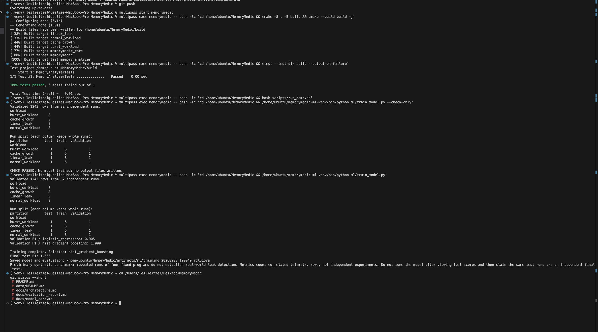

# MemoryMedic

[](https://github.com/leslieraya555/MemoryMedic/actions/workflows/ci.yml)

MemoryMedic is a Linux process-monitoring and memory-leak detection system written in C++ and Python. It reads process statistics from the Linux `/proc` filesystem, records memory telemetry in CSV format, evaluates memory-growth behavior, and applies a trained machine-learning model to classify new measurements as `normal` or `leak`.

The repository combines systems programming with a reproducible machine-learning workflow. C++ components collect and analyze operating-system data with low overhead. Python components validate collected runs, engineer time-series features, compare classification models, preserve evaluation metadata, and generate predictions from new telemetry files.

## Core Capabilities

* Monitors an active Linux process by process ID.
* Reads resident memory, virtual memory, peak memory, thread counts, and page-fault information from `/proc`.
* Calculates memory-growth behavior and assigns a rule-based risk assessment.
* Writes timestamped telemetry samples to CSV files.
* Runs controlled normal, burst, cache-growth, and linear-leak workloads.
* Collects independent workload repetitions for model development.
* Prevents rows from the same run from appearing in different data partitions.
* Compares logistic regression with histogram-based gradient boosting.
* Saves the selected model together with metrics, split membership, dependency versions, and checksums.
* Loads a trained model and reports leak probabilities for new MemoryMedic CSV files.
* Uses GitHub Actions to build the C++ code and run automated tests.

## System Workflow

1. A controlled workload or another Linux application starts running.
2. `ProcReader` reads process information from Linux `/proc` files.
3. `MemoryAnalyzer` calculates memory changes and growth rates.
4. `RiskAssessment` evaluates the observed behavior.
5. `TelemetryLogger` saves the measurements to a CSV file.
6. `feature_engineering.py` converts raw telemetry into model-ready features.
7. `train_model.py` validates completed runs, creates grouped data partitions, compares candidate models, and saves the selected model.
8. `predict_csv.py` loads the saved model and classifies new telemetry rows.

## Workloads

Four C++ workload programs provide controlled memory behaviors:

| Workload             | Behavior                                                        | Label  |
| -------------------- | --------------------------------------------------------------- | ------ |
| `NormalWorkload.cpp` | Allocates a stable amount of memory and repeatedly accesses it. | normal |
| `CacheGrowth.cpp`    | Simulates intentional memory growth caused by caching.          | normal |
| `BurstWorkload.cpp`  | Produces temporary increases followed by recovery.              | normal |
| `LinearLeak.cpp`     | Continuously allocates memory without releasing it.             | leak   |

Cache growth and temporary bursts are labeled `normal` because increasing memory use does not always indicate a leak. The classifier must distinguish expected growth patterns from sustained unreleased allocation.

## Repository Structure

```text
MemoryMedic/
├── .github/workflows/ci.yml      # GitHub Actions build and test workflow
├── CMakeLists.txt                # CMake configuration
├── data/                         # Example CSVs and collected telemetry
├── docs/                         # Architecture, evaluation, and model documentation
├── include/memorymedic/          # C++ header files
├── ml/                           # Feature engineering, training, and prediction
├── scripts/                      # Demonstration and dataset-collection scripts
├── src/                          # C++ implementation files
├── tests/                        # Automated C++ tests
└── workloads/                    # Controlled workload programs
```

Generated build files, virtual environments, completed collection batches, and trained model artifacts are excluded from Git.

## Requirements

### C++ Monitoring Components

* Linux environment with the `/proc` filesystem
* CMake
* A C++17-compatible compiler such as GCC or Clang

### Machine-Learning Components

* Python 3
* NumPy
* pandas
* scikit-learn
* joblib
* SciPy

The tested training environment used Python 3.14.4, NumPy 2.5.2, pandas 3.0.5, scikit-learn 1.9.0, joblib 1.6.0, and SciPy 1.18.1.

## Build and Test

Run the following commands inside a Linux environment from the repository root:

```bash
cmake -S . -B build
cmake --build build
ctest --test-dir build --output-on-failure
```

The build compiles the MemoryMedic application, controlled workloads, and test executable. The test command displays detailed output if a test fails.

Mac users can run the Linux components inside the configured Multipass instance:

```bash
multipass start memorymedic
multipass exec memorymedic -- bash -lc 'cd /home/ubuntu/MemoryMedic && cmake -S . -B build && cmake --build build -j'
multipass exec memorymedic -- bash -lc 'cd /home/ubuntu/MemoryMedic && ctest --test-dir build --output-on-failure'
```

## Run the Demonstration

After building, run the demonstration inside Multipass:

```bash
multipass exec memorymedic -- bash -lc 'cd /home/ubuntu/MemoryMedic && bash scripts/run_demo.sh'
```

The demonstration starts controlled workloads, monitors their processes, and produces example telemetry that can be inspected before creating a larger dataset.

## Collect Training Data

The collection script accepts the number of repetitions per workload and the duration of each run in seconds.

The following command collects three repetitions of every workload, with each run lasting 40 seconds:

```bash
bash scripts/collect_dataset.sh 3 40
```

From macOS, run the collection inside Multipass:

```bash
multipass exec memorymedic -- bash -lc 'cd /home/ubuntu/MemoryMedic && bash scripts/collect_dataset.sh 3 40'
```

Each collection receives its own directory under `data/`. Raw CSV files are stored separately, and `runs.csv` records the independent executions. A batch is considered usable only after collection completes successfully.

## Prepare the Python Environment

Create the virtual environment inside Ubuntu instead of inside the shared macOS project directory:

```bash
python3 -m venv /home/ubuntu/memorymedic-ml-venv
/home/ubuntu/memorymedic-ml-venv/bin/python -m pip install --upgrade pip
/home/ubuntu/memorymedic-ml-venv/bin/python -m pip install -r /home/ubuntu/MemoryMedic/ml/requirements.txt
```

Keeping the environment outside the mounted repository avoids virtual-environment symlink problems and prevents dependency files from being committed.

## Validate the Dataset

Check the available runs without training a model:

```bash
multipass exec memorymedic -- bash -lc 'cd /home/ubuntu/MemoryMedic && /home/ubuntu/memorymedic-ml-venv/bin/python ml/train_model.py --check-only'
```

Validation rejects incomplete batches and checks required columns, labels, identifiers, timestamps, and numerical values. The command also displays the number of independent runs and the grouped partition plan.

Successful validation ends with:

```text
CHECK PASSED. No model trained; no output files written.
```

## Train the Model

Run the complete training pipeline:

```bash
multipass exec memorymedic -- bash -lc 'cd /home/ubuntu/MemoryMedic && /home/ubuntu/memorymedic-ml-venv/bin/python ml/train_model.py'
```

Training performs the following operations:

1. Discovers completed dataset collections.
2. Validates CSV contents and run metadata.
3. Engineers raw, rolling, ratio, and growth features.
4. Groups rows by `run_id` before partitioning.
5. Compares candidate classifiers on the validation runs.
6. Refits the selected classifier using training and validation data.
7. Evaluates the selected model once on untouched test runs.
8. Saves the model, metrics, partitions, versions, and file checksums in a uniquely named artifact directory.

## Generate Predictions

Select the latest model and a collected leak CSV:

```bash
multipass exec memorymedic -- bash -lc 'cd /home/ubuntu/MemoryMedic && model=$(ls -dt artifacts/ml/training_*/memorymedic_model.joblib | head -n 1) && csv=$(ls -t data/collection_*/raw/*linear_leak*.csv | head -n 1) && /home/ubuntu/memorymedic-ml-venv/bin/python ml/predict_csv.py --model "$model" --rows 10 "$csv"'
```

Prediction output includes:

* `ml_leak_probability`: Estimated probability from 0 to 1.
* `ml_prediction`: Either `normal` or `leak`.

The default classification threshold is 0.50. Only trusted model files should be loaded because joblib artifacts can execute Python code while loading.

## Dataset and Evaluation Results

The completed synthetic dataset contains **1,243 telemetry rows from 32 independent runs**, with eight executions of each workload.

Runs were divided by workload into six training runs, one validation run, and one held-out test run. Grouping by `run_id` keeps all correlated rows from a single execution in the same partition.

| Candidate model                   | Validation F1 |
| --------------------------------- | ------------: |
| Logistic regression               |         0.905 |
| Histogram-based gradient boosting |         1.000 |

Histogram-based gradient boosting was selected.

On 156 rows from four held-out test runs, the selected model produced:

| Metric            | Result |
| ----------------- | -----: |
| Accuracy          |  1.000 |
| Precision         |  1.000 |
| Recall            |  1.000 |
| F1 score          |  1.000 |
| Average precision |  1.000 |
| ROC AUC           |  1.000 |
| True negatives    |    117 |
| True positives    |     39 |
| False positives   |      0 |
| False negatives   |      0 |

The perfect held-out score applies only to the included controlled workloads. Thirty-two independent runs are not sufficient evidence of production reliability. The 1,243 telemetry rows are correlated observations rather than 1,243 independent experiments.

## Build, Test, and Training Verification

The terminal output below confirms that the C++ components compiled successfully, all automated tests passed, dataset validation completed, and the machine-learning model was trained and evaluated.



## Saved Training Artifacts

Every successful training run creates a new directory under `artifacts/ml/` containing:

| File                       | Purpose                                                                |
| -------------------------- | ---------------------------------------------------------------------- |
| `memorymedic_model.joblib` | Selected classifier, feature list, threshold, and supporting metadata. |
| `evaluation.json`          | Validation results, held-out test metrics, versions, and checksums.    |
| `splits.csv`               | Exact training, validation, and test run assignments.                  |
| `requirements-used.txt`    | Installed numerical-library versions used for training.                |
| `COMPLETE.txt`             | Confirms that every output step finished successfully.                 |

Artifacts are excluded from Git because they are generated outputs and can be recreated from the source code and collected data.

## Reliability and Limitations

* Linux `/proc` telemetry is platform-specific.
* Training data comes from four fixed synthetic programs in one controlled environment.
* Only one workload currently represents the leak class.
* Real applications may contain allocation patterns that are absent from the collected data.
* Hardware, operating-system settings, sampling intervals, and background activity may change feature distributions.
* The current evaluation uses a grouped train/validation/test split rather than grouped k-fold cross-validation.
* A `leak` prediction should trigger developer investigation, not automatic process termination or destructive remediation.

Broader validation requires more independent runs, additional leak types, unfamiliar real applications, longer monitoring periods, multiple Linux environments, probability calibration, and production-like false-positive measurements.

## Challenges and Lessons Learned

Several technical challenges occurred while developing MemoryMedic:

* **Linux-specific monitoring:** MemoryMedic reads process information from Linux `/proc`, which is unavailable natively on macOS. An Ubuntu virtual machine was configured with Multipass so the monitoring components could run correctly.

* **Python environment setup:** Creating a virtual environment inside the shared project directory caused compatibility problems. The environment was moved to `/home/ubuntu/memorymedic-ml-venv`, outside the mounted repository.

* **Insufficient initial data:** The first dataset contained only two independent runs per workload, which was not enough for separate training, validation, and test partitions. Additional collections increased the dataset to eight runs per workload and 32 independent runs overall.

* **Preventing data leakage:** Randomly splitting individual telemetry rows could place measurements from the same execution into multiple partitions. The training pipeline was changed to group data by `run_id`, keeping every run entirely within one partition.

* **Repository organization:** Git initially detected a repository located in the macOS home directory instead of one dedicated to MemoryMedic. A separate repository was initialized inside the MemoryMedic folder, connected to the correct GitHub remote, and protected with an appropriate `.gitignore`.

* **Generated files:** Build files, virtual environments, collected batches, and trained-model artifacts created unnecessary repository clutter. These files were excluded from Git while retaining the source code and small demonstration CSV files required to reproduce the workflow.

* **Interpreting perfect results:** The selected model achieved perfect metrics on the held-out synthetic test data. Rather than treating this as proof of real-world reliability, the result was documented as preliminary because the data came from four controlled workload programs.

Resolving these challenges produced clearer environment separation, safer data partitioning, cleaner version control, and more responsible interpretation of machine-learning results.

## Documentation

* [`docs/architecture.md`](docs/architecture.md): Component responsibilities and data flow.
* [`docs/evaluation_report.md`](docs/evaluation_report.md): Dataset design, partitioning, metrics, and interpretation.
* [`docs/model_card.md`](docs/model_card.md): Intended use, model behavior, limitations, and responsible-use guidance.
* [`docs/interview_guide.md`](docs/interview_guide.md): Technical design questions and explanations.
* [`data/README.md`](data/README.md): Telemetry files, labels, and dataset organization.

## Continuous Integration

The workflow in `.github/workflows/ci.yml` automatically configures the CMake build, compiles the C++ targets, and runs the automated tests for changes pushed to GitHub.

Workflow results are available on the repository’s [Actions page](https://github.com/leslieraya555/MemoryMedic/actions).

## Author

Leslie Raya

GitHub: [leslieraya555](https://github.com/leslieraya555)
