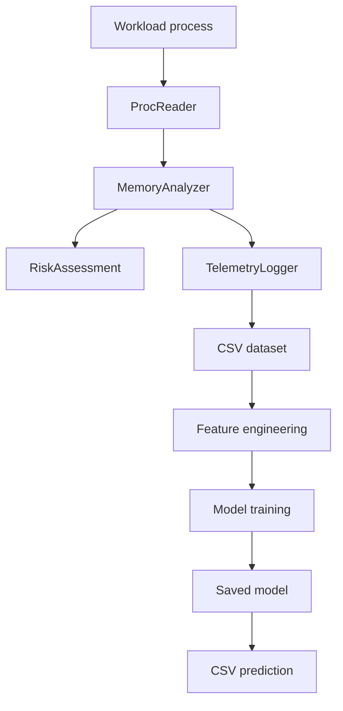

# MemoryMedic Architecture

**Project:** MemoryMedic  
**Author:** Leslie Raya

## 1. System Overview

MemoryMedic is a Linux process-monitoring and memory-leak detection project. The C++ portion monitors a running process and records memory telemetry. The Python machine-learning portion converts that telemetry into numerical features, trains classification models, and predicts whether new measurements resemble a memory leak.

The project is separated into five main stages:

1. Generate controlled normal and leak workloads.
2. Read process information from Linux `/proc` files.
3. Analyze memory behavior and save telemetry to CSV files.
4. Engineer features and train a classification model.
5. Load the saved model and classify new telemetry.

## 2. High-Level Data Flow

Each workload runs as a separate process. MemoryMedic samples that process repeatedly, calculates memory-related measurements, and saves the results. The training pipeline keeps complete monitoring runs together when separating training, validation, and test data. This prevents measurements from the same experiment from appearing in more than one partition.

## 3. C++ Monitoring Components

| Component | Responsibility |
| --- | --- |
| `src/main.cpp` | Provides the command-line entry point and coordinates monitoring. |
| `ProcReader` | Reads process statistics from the Linux `/proc` filesystem. |
| `MemoryAnalyzer` | Calculates memory growth, changes, and stability measurements. |
| `RiskAssessment` | Converts analyzed behavior into a human-readable risk assessment. |
| `TelemetryLogger` | Writes measurements and experiment metadata to CSV files. |
| `MemoryMedic` | Coordinates the reader, analyzer, risk assessment, and logger. |

Public C++ interfaces are stored in `include/memorymedic/`, while their implementations are stored in `src/`.

## 4. Synthetic Workloads

The `workloads/` directory contains controlled programs used to test the monitor and create labeled training data.

| Workload | Expected behavior | Dataset label |
| --- | --- | --- |
| `NormalWorkload.cpp` | Allocates a stable amount of memory and continues using it. | `normal` |
| `CacheGrowth.cpp` | Simulates intentional memory growth associated with caching. | `normal` |
| `BurstWorkload.cpp` | Produces temporary memory increases that later stabilize or decrease. | `normal` |
| `LinearLeak.cpp` | Continuously allocates memory without releasing it. | `leak` |

These programs provide repeatable examples for preliminary testing. They do not represent every memory pattern found in real production applications.

## 5. Telemetry and Dataset Structure

The collection script runs each workload independently and stores each run in a separate CSV file. Important fields used by the ML pipeline include:

- `timestamp_ms`
- `rss_kb`
- `virtual_memory_kb`
- `peak_rss_kb`
- `threads`
- `rss_growth_kb_s`
- `minor_faults_s`
- `major_faults_s`
- `run_id`
- `workload`
- `label`

`run_id` identifies the experiment that produced each row. The label is either `normal` or `leak`.

Generated collection folders are excluded from Git because they are reproducible and may grow considerably. Small demonstration CSV files remain in the repository as examples.

## 6. Machine-Learning Components

| File | Responsibility |
| --- | --- |
| `ml/feature_engineering.py` | Validates telemetry columns and creates derived numerical features. |
| `ml/train_model.py` | Loads data, keeps runs grouped, compares candidate classifiers, evaluates the selected model, and saves artifacts. |
| `ml/predict_csv.py` | Loads the saved model and predicts leak probabilities for a CSV file. |
| `ml/requirements.txt` | Lists the Python dependencies needed by the ML pipeline. |

The engineered features include raw memory measurements plus RSS change, rolling RSS statistics, the virtual-to-resident-memory ratio, and the major-fault ratio.

Two candidate classifiers are compared:

- Logistic regression
- Histogram-based gradient boosting

The model with the stronger validation F1 score is selected. The classifier, feature definitions, threshold, and related metadata are stored together so prediction uses the same processing rules as training.

## 7. Dataset Partitioning

The validated dataset contains 1,243 telemetry rows from 32 independent runs. Each of the four workloads contributes eight runs.

For each workload, complete runs are divided into:

- Six training runs
- One validation run
- One test run

Rows from the same `run_id` never appear in multiple partitions. The test partition is held out until final evaluation. This is a grouped train/validation/test design; it should not be described as k-fold cross-validation unless a separate grouped k-fold procedure is added.

## 8. Build and Automation

CMake builds the C++ monitor, workload executables, and tests. GitHub Actions runs the continuous-integration workflow stored at `.github/workflows/ci.yml`. The workflow checks the project automatically whenever qualifying changes are pushed to GitHub.

Generated content is excluded through `.gitignore`, including:

- Build output
- Python virtual environments
- Python cache files
- Full generated dataset collections
- Training artifacts and serialized model files

## 9. Design Decisions

- **Linux-first monitoring:** `/proc` provides process telemetry without requiring changes to the monitored application.
- **Separated responsibilities:** Reading, analysis, risk assessment, logging, feature engineering, training, and prediction are isolated into focused components.
- **Run-level data separation:** Grouping by `run_id` reduces data leakage between training and evaluation partitions.
- **Reproducible workloads:** Controlled workloads make it possible to verify the complete system consistently.
- **Saved training metadata:** Model artifacts preserve the information needed to reproduce and interpret predictions.

## 10. Limitations and Future Work

The present evaluation uses a small controlled synthetic dataset. High scores on these workloads do not prove that the system will detect memory leaks reliably in unrelated real-world software.

Future work should include:

- Collecting data from diverse real applications and longer monitoring sessions.
- Adding more normal behaviors and additional leak patterns.
- Evaluating performance with grouped k-fold cross-validation when required.
- Measuring false-positive rates on production-like workloads.
- Testing different operating systems or adding platform-specific monitoring backends.
- Measuring monitoring overhead and prediction latency.
